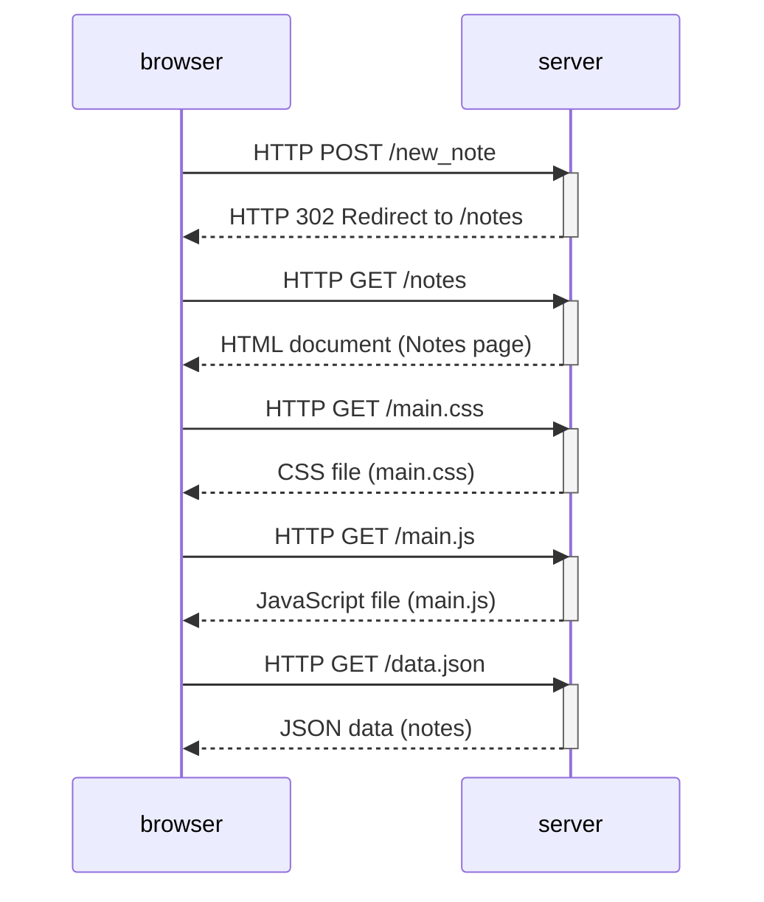

```mermaid
sequenceDiagram
    participant browser
    participant server

    browser->>server: HTTP POST /new_note
    activate server
    server-->>browser: HTTP 302 Redirect to /notes
    deactivate server

    browser->>server: HTTP GET /notes
    activate server
    server-->>browser: HTML document (Notes page)
    deactivate server

    browser->>server: HTTP GET /main.css
    activate server
    server-->>browser: CSS file (main.css)
    deactivate server

    browser->>server: HTTP GET /main.js
    activate server
    server-->>browser: JavaScript file (main.js)
    deactivate server

    browser->>server: HTTP GET /data.json
    activate server
    server-->>browser: JSON data (notes)
    deactivate server
```
