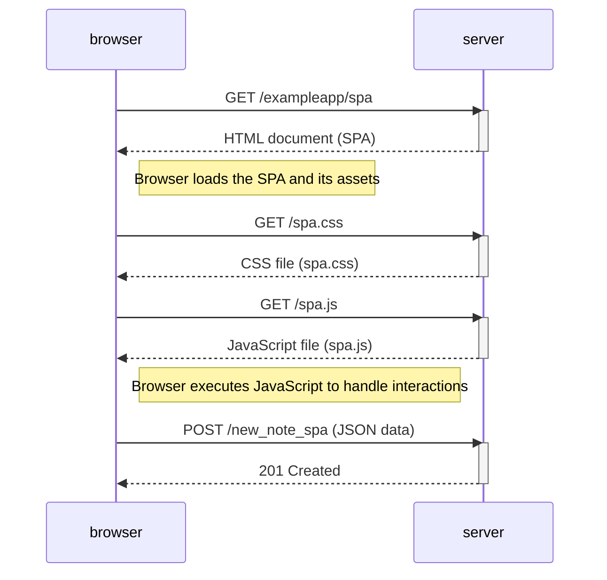

```mermaid
sequenceDiagram
    participant browser
    participant server

    browser->>server: GET /exampleapp/spa
    activate server
    server-->>browser: HTML document (SPA)
    deactivate server

    Note right of browser: Browser loads the SPA and its assets

    browser->>server: GET /spa.css
    activate server
    server-->>browser: CSS file (spa.css)
    deactivate server

    browser->>server: GET /spa.js
    activate server
    server-->>browser: JavaScript file (spa.js)
    deactivate server

    Note right of browser: Browser executes JavaScript to handle interactions

    browser->>server: POST /new_note_spa (JSON data)
    activate server
    server-->>browser: 201 Created
    deactivate server
```